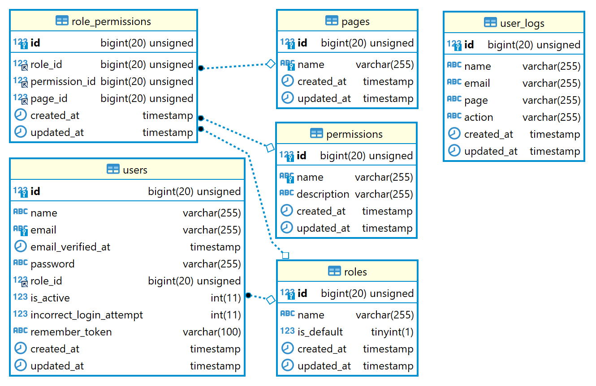

## About Laravel API Wrapper

Laravel API wrapper is laravel 8 application that has been configured to boost starting of laravel API development

- [All Laravel 8 Features (found here)](https://laravel.com/docs/8.x) plus additional benefits
- [Pre-configured JWT Authentication by Sean Tymon](https://jwt-auth.readthedocs.io/en/develop/laravel-installation/).
- Pre-configured Roles and Permission on Models, Controllers and Middlewares.

Laravel is accessible, powerful, and provides tools required for large, robust applications.

## Learning Laravel

Laravel has the most extensive and thorough [documentation](https://laravel.com/docs) and video tutorial library of all modern web application frameworks, making it a breeze to get started with the framework.

If you don't feel like reading, [Laracasts](https://laracasts.com) can help. Laracasts contains over 1500 video tutorials on a range of topics including Laravel, modern PHP, unit testing, and JavaScript. Boost your skills by digging into our comprehensive video library.

## Contributing

Thank you for considering contributing to the Laravel 8 Wrapper! Send a PR with details on the contribution to help us understand.

## Security Vulnerabilities

If you discover a security vulnerability within Laravel, please send an e-mail to Taylor Otwell via [taylor@laravel.com](mailto:taylor@laravel.com). All security vulnerabilities will be promptly addressed.

## License

The Laravel 8 Wrapper is open-sourced software licensed under the [GNU License](https://opensource.org/licenses/GNU).
